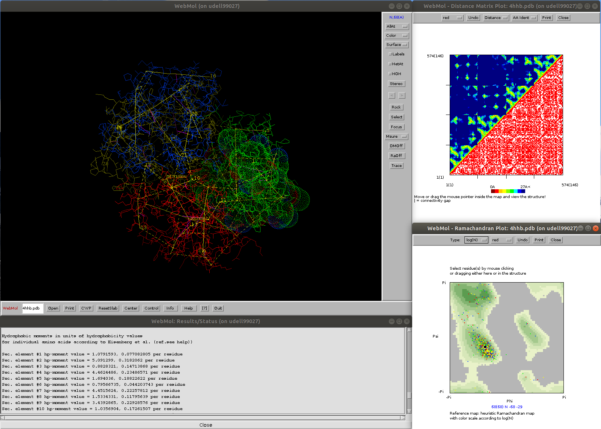

# WebMol
Java-based protein viewer and analysis program

Launch WebMol (Windows: double click on jar file, Linux: java -jar webmol.jar)
Load structure in PDB-file format, either by invoking "Open" or, 
under Linux, as a parameter: java -jar webmol.jar <pdb-file>

  Example: java -jar webmol.jar https://files.rcsb.org/view/4HHB.pdb

For help/instructions, see "Help"

Reference:
Walther, D (1997) WebMol--a Java-based PDB viewer. Trends in biochemical sciences 22 (7), 274-275

Source code available upon request.
WebMol was developed at the EMBL (Heidelberg, Germany) and UCSF (San Francisoco, USA) in the years 1996-1999

Author: Dirk Walther
walther@mpimp-golm.mpg.de

<b>Unique features, highlights</b>
  - Analysis of packing geometries of secondary structural elements (axes, distances, and angles)
  - surface and cavity computations, including surface and volume area computation
  - interactive distance matrix and Ramachandran plots, with differential Ramachandran map as reference (see https://pubmed.ncbi.nlm.nih.gov/10089363/)

  
  <!DOCTYPE HTML PUBLIC "-//W3C//DTD HTML 3.2//EN">
<!--NewPage-->
<html>
<head>
<!-- Generated by javadoc on Tue Mar 10 10:44:35 PST 1998 -->

<title>WebMol API</title>
<title>
  Class webmol 
</title>
</head>
<body>

<h1>
  Class webmol
</h1>
<pre>
java.lang.Object
   |
   +----java.awt.Component
           |
           +----java.awt.Container
                   |
                   +----java.awt.Window
                           |
                           +----java.awt.Frame
                                   |
                                   +----webmol
</pre>

<dl>
  <dt> public class <b>webmol</b>
  <dt> extends Frame
</dl>
<pre>
WebMol - Java PDB structure viewing and analysis program
Author: Dirk Walther (walther@cmpharm.ucsf.edu)
Version March 10, 1998

  European Molecular Biology Laboratory (EMBL)
  June 1996-March 1997
  University of California, San Francisco (UCSF)
  April 1997-

Reference:
  Walther D. (1997) WebMol - a Java based PDB viewer.
  Trends Biochem Sci, 22: 274-275

WWW: 
  http://www.cmpharm.ucsf.edu/cgi-bin/webmol.pl
  or http://www.embl-heidelberg.de/cgi/viewer.pl
</pre>

<b>Example</b> ("webmolExample.java")

<pre>

import webmol;

public class webmolExample
{
  
public static void main(String args[])
  {
    int num,add=1,col;
    

    webmol wm=new webmol("pdb1ppt.ent",700,600);
    // webmol wm=new webmol("http://www.embl-heidelberg.de/~walther/JAVA/pdb/1ppt.brk",700,600);
    // reads it across the web
    // webmol wm=new webmol("ftp://pdb.pdb.bnl.gov//fullrelease/uncompressed_files/pp/pdb1ppt.ent",700,600);
    // reads it from PDB directly

    num=wm.getNumberOfResidues(); 

    int res=0;
    
    for(int j=0;j<2*num;j++)
    {

           
      if(wm.getResidueType(res)=='P') // if amino acid = proline then color yellow
        col=wm.yellow;
      else
        col=wm.current; // current color set by WebMol
      
      wm.select(res,
                wm.SIDECHAIN_VS_SIDECHAIN,
                col,
                wm.THICK);
      
      wm.redraw(500);
      
      if(res==num-1) add=-1;
      if(res==0) add=1;

      wm.unselect(res);
      res+=add;
    }
    wm.close(true);
    
  
    
  }
}
</pre>

<h2>
  
</h2>
<dl>
  <dt> 
	<a href="#blue"><b>blue</b></a>
  <dd> Color to apply for selection highlighting
  <dt> 
	<a href="#current"><b>current</b></a>
  <dd> Color to apply for selection highlighting
  <dt> 
	<a href="#cyan"><b>cyan</b></a>
  <dd> Color to apply for selection highlighting
  <dt> 
	<a href="#gray"><b>gray</b></a>
  <dd> Color to apply for selection highlighting
  <dt> 
	<a href="#lilac"><b>lilac</b></a>
  <dd> Color to apply for selection highlighting
  <dt> 
	<a href="#orange"><b>orange</b></a>
  <dd> Color to apply for selection highlighting
  <dt> 
	<a href="#pink"><b>pink</b></a>
  <dd> Color to apply for selection highlighting
  <dt> 
	<a href="#red"><b>red</b></a>
  <dd> Color to apply for selection highlighting
  <dt> 
	<a href="#yellow"><b>yellow</b></a>
  <dd> Color to apply for selection highlighting
  <dt> 
	<a href="#SELECTED_ONLY"><b>SELECTED_ONLY</b></a>
  <dd> Select method
  <dt> 
	<a href="#SIDECHAIN_VS_BACKBONE"><b>SIDECHAIN_VS_BACKBONE</b></a>
  <dd> Select method
  <dt> 
	<a href="#SIDECHAIN_VS_SIDECHAIN"><b>SIDECHAIN_VS_SIDECHAIN</b></a>
  <dd> Select method
  <dt> 
	<a href="#THICK"><b>THICK</b></a>
  <dd> thick lines
  <dt> 
	<a href="#THIN"><b>THIN</b></a>
  <dd> thin lines

</dl>
<h2>
  
</h2>
<dl>
  <dt> 
	<a href="#webmol(java.lang.String)"><b>webmol</b></a>(String)
  <dd> launching WebMol with default width and height, upon closing the WebMol frame all Java programs
will be exited.
  <dt> 
	<a href="#webmol(java.lang.String, boolean)"><b>webmol</b></a>(String, boolean)
  <dd> 
  <dt> 
	<a href="#webmol(java.lang.String, boolean, int, int)"><b>webmol</b></a>(String, boolean, int, int)
  <dd> 
  <dt> 
	<a href="#webmol(java.lang.String, int, int)"><b>webmol</b></a>(String, int, int)
  <dd> 
</dl>
<h2>
  
</h2>
<dl>
  <dt> 
	<a href="#close()"><b>close</b></a>()
  <dd> close WebMol

  <dt> 
	<a href="#close(boolean)"><b>close</b></a>(boolean)
  <dd> close Webmol and exit (exit=true)/ not exit (exit=false) all current Java programs under which WebMol was running

  <dt> 
	<a href="#getChainID(int)"><b>getChainID</b></a>(int)
  <dd> returns the chain identifier of residue res 

  <dt> 
	<a href="#getNumberOfResidues()"><b>getNumberOfResidues</b></a>()
  <dd> returns the number of amino acid residues in the current protein structure
  <dt> 
	<a href="#getPDBSeqNum(int)"><b>getPDBSeqNum</b></a>(int)
  <dd> returns the PDB sequence number of residue res as it may differ
from the consecutive enumeration used by WebMol

  <dt> 
	<a href="#getResidueType(int)"><b>getResidueType</b></a>(int)
  <dd> returns the amino acid type (one-letter code) of residue res 

 

  <dt> 
	<a href="#redraw()"><b>redraw</b></a>()
  <dd> redraw the structure in the WebMol main window

  <dt> 
	<a href="#redraw(int)"><b>redraw</b></a>(int)
  <dd> redraw the structure in the WebMol main window

  <dt> 
	<a href="#select(int, int, int, int)"><b>select</b></a>(int, int, int, int)
  <dd> select a single residue, enumeration of residues is in consecutive order;
i.e.
  <dt> 
	<a href="#unselect(int)"><b>unselect</b></a>(int)
  <dd> unselect residue

  <dt> 
	<a href="#unselectAll()"><b>unselectAll</b></a>()
  <dd> undo all selections
</dl>

<h2>
  
</h2>

<b>THICK</b>
<pre>
 public static final int THICK
</pre>
<dl>
  <dd> thick lines

</dl>

<b>THIN</b>
<pre>
 public static final int THIN
</pre>
<dl>
  <dd> thin lines

</dl>

<b>current</b>
<pre>
 public static final int current
</pre>
<dl>
  <dd> Color to apply for selection highlighting

</dl>

<b>red</b>
<pre>
 public static final int red
</pre>
<dl>
  <dd> Color to apply for selection highlighting

</dl>

<b>blue</b>
<pre>
 public static final int blue
</pre>
<dl>
  <dd> Color to apply for selection highlighting

</dl>

<b>yellow</b>
<pre>
 public static final int yellow
</pre>
<dl>
  <dd> Color to apply for selection highlighting

</dl>

<b>lilac</b>
<pre>
 public static final int lilac
</pre>
<dl>
  <dd> Color to apply for selection highlighting

</dl>

<b>gray</b>
<pre>
 public static final int gray
</pre>
<dl>
  <dd> Color to apply for selection highlighting

</dl>

<b>pink</b>
<pre>
 public static final int pink
</pre>
<dl>
  <dd> Color to apply for selection highlighting

</dl>

<b>cyan</b>
<pre>
 public static final int cyan
</pre>
<dl>
  <dd> Color to apply for selection highlighting

</dl>

<b>orange</b>
<pre>
 public static final int orange
</pre>
<dl>
  <dd> Color to apply for selection highlighting

</dl>

<b>SELECTED_ONLY</b>
<pre>
 public static final int SELECTED_ONLY
</pre>
<dl>
  <dd> Select method

</dl>

<b>SIDECHAIN_VS_BACKBONE</b>
<pre>
 public static final int SIDECHAIN_VS_BACKBONE
</pre>
<dl>
  <dd> Select method

</dl>

<b>SIDECHAIN_VS_SIDECHAIN</b>
<pre>
 public static final int SIDECHAIN_VS_SIDECHAIN
</pre>
<dl>
  <dd> Select method

</dl>

<h2>
  
</h2>

<b>webmol</b>
<pre>
 public webmol(String Protein,
               boolean invoked,
               int width,
               int height)
</pre>
<dl>
  <dd><dl>
    <dt> <b>Parameters:</b>
    <dd> Protein - PDB-file
    <dd> invoked - determines how to respond to closures of the WebMol Frame;
true: close WebMol only, false: close WebMol and all Java programs under which WebMol was running
    <dd> width - frame width
    <dd> height - frame height
  </dl></dd>
</dl>

<b>webmol</b>
<pre>
 public webmol(String Protein,
               int width,
               int height)
</pre>
<dl>
  <dd><dl>
    <dt> <b>Parameters:</b>
    <dd> Protein - PDB-file
    <dd> width - width of the WebMol frame
    <dd> height - height of the WebMol frame
  </dl></dd>
</dl>

<b>webmol</b>
<pre>
 public webmol(String Protein)
</pre>
<dl>
  <dd> launching WebMol with default width and height, upon closing the WebMol frame all Java programs
will be exited.

  <dd><dl>
    <dt> <b>Parameters:</b>
    <dd> Protein - PDB-file
  </dl></dd>
</dl>

<b>webmol</b>
<pre>
 public webmol(String Protein,
               boolean invoked)
</pre>
<dl>
  <dd><dl>
    <dt> <b>Parameters:</b>
    <dd> Protein - PDB-file
    <dd> invoked - set true to exit WebMol without closing the program that invoked WebMol
  </dl></dd>
</dl>

<h2>
  
</h2>

<a name="close"><b>close</b></a>
<pre>
 public void close()
</pre>
<dl>
  <dd> close WebMol

</dl>

<a name="close"><b>close</b></a>
<pre>
 public void close(boolean exit)
</pre>
<dl>
  <dd> close Webmol and exit (exit=true)/ not exit (exit=false) all current Java programs under which WebMol was running

  <dd><dl>
    <dt> <b>Parameters:</b>
    <dd> exit - true for exit all programs, false for just leaving WebMol
  </dl></dd>
</dl>

<a name="select"><b>select</b></a>
<pre>
 public void select(int res,
                    int selectMethod,
                    int color,
                    int thick)
</pre>
<dl>
  <dd> select a single residue, enumeration of residues is in consecutive order;
i.e. from 0 to num-1, irrespective of pdb enumerations

  <dd><dl>
    <dt> <b>Parameters:</b>
    <dd> res - residue number (consecutive order
    <dd> selectMethod - method of highlighting selected residues, values can be
SELECTED_ONLY (display selected residues only), SIDECHAIN_VS_BACKBONE (display sidechains of selected residues against the protein backbone), SIDECHAIN_VS_SIDECHAIN (keep displaying all residues against highlighted selected residues)
    <dd> color - color to be used for highlighting selected residue (see Fields)
    <dd> thick - line thickness (THICK or THIN)
  </dl></dd>
</dl>

<a name="unselect"><b>unselect</b></a>
<pre>
 public void unselect(int res)
</pre>
<dl>
  <dd> unselect residue

  <dd><dl>
    <dt> <b>Parameters:</b>
    <dd> res - residue number
  </dl></dd>
</dl>

<a name="unselectAll"><b>unselectAll</b></a>
<pre>
 public void unselectAll()
</pre>
<dl>
  <dd> undo all selections

</dl>

<a name="getNumberOfResidues"><b>getNumberOfResidues</b></a>
<pre>
 public int getNumberOfResidues()
</pre>
<dl>
  <dd> returns the number of amino acid residues in the current protein structure

</dl>

<a name="getPDBSeqNum"><b>getPDBSeqNum</b></a>
<pre>
 public int getPDBSeqNum(int res)
</pre>
<dl>
  <dd> returns the PDB sequence number of residue res as it may differ
from the consecutive enumeration used by WebMol

  <dd><dl>
    <dt> <b>Parameters:</b>
    <dd> res - residue (consecutive order)
  </dl></dd>
</dl>

<a name="getResidueType"><b>getResidueType</b></a>
<pre>
 public char getResidueType(int res)
</pre>
<dl>
  <dd> returns the amino acid type (one-letter code) of residue res

  <dd><dl>
    <dt> <b>Parameters:</b>
    <dd> res - residue (consecutive order)
  </dl></dd>
</dl>

<a name="getChainID"><b>getChainID</b></a>
<pre>
 public char getChainID(int res)
</pre>
<dl>
  <dd> returns the chain identifier of residue res

  <dd><dl>
    <dt> <b>Parameters:</b>
    <dd> res - residue (consecutive order)
  </dl></dd>
</dl>

<a name="redraw"><b>redraw</b></a>
<pre>
 public void redraw(int delay)
</pre>
<dl>
  <dd> redraw the structure in the WebMol main window

  <dd><dl>
    <dt> <b>Parameters:</b>
    <dd> delay - redraw after <delay> milliseconds
  </dl></dd>
</dl>

<a name="redraw"><b>redraw</b></a>
<pre>
 public void redraw()
</pre>
<dl>
  <dd> redraw the structure in the WebMol main window

</dl>

</body>
</html>
