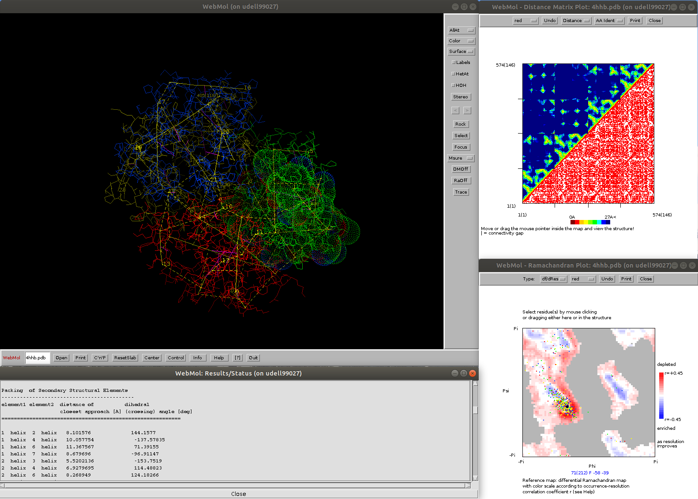

# WebMol
Java-based protein viewer and analysis program

Launch WebMol (Windows: double click on jar file, Linux: java -jar webmol.jar)
Load structure in PDB-file format, either by invoking "Open" or, 
under Linux, as a parameter: java -jar webmol.jar <pdb-file>
  Example: java -jar webmol.jar https://files.rcsb.org/view/4HHB.pdb
For help/instructions, see "Help"

Reference:
WebMol--a Java-based PDB viewer.
D Walther,
Trends in biochemical sciences 22 (7), 274-275

Source code available upon request.
WebMol was developed at the EMBL (Heidelberg, Germany) and UCSF (San Francisoco, USA) in the years 1996-1999

Author: Dirk Walther
walther@mpimp-golm.mpg.de

<b>Unique features, highlights</b>
  - Analysis of packing geometries of secondary structural elements (axes and angles)
  - surface and cavity computations, including surface and volume area computation
  - interactive distance matrix and Ramachandran plots, with differential Ramachandran map as reference (see https://pubmed.ncbi.nlm.nih.gov/10089363/)

